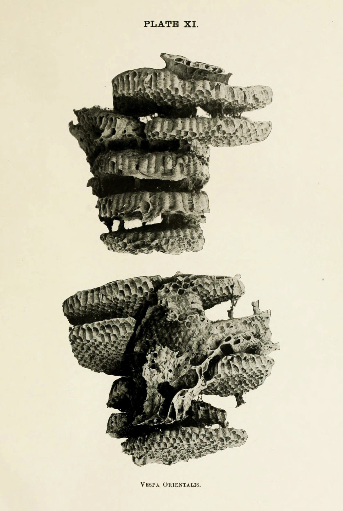

This is my SuperCollider synthdef library and factory. It produces tons of variations of synths that I use. Some of the synths in here are based on stuff found on [scsynth.org](https://scsynth.org), [sccode.org](https://sccode.org), the SuperCollider mailing list. Thank you to everyone sharing their ideas!


The motivation for making this library was to create a central place for my synths but also a unified interface to make sure that all synths are expected to respond to the same parameters in the same way (especially pertaining to timing, envelopes and filters etc.) to make it easier for me to focus on the composition work.

### Usage
This library is meant for myself and I am not offering support in using it, but feel free to try it anyway and steal bits of it for your own projects.

Running `MKSynthLib.new(numChannelsOut: 2, verbose: true)` will generate all synths.

Running `MKGenPat(synthName)` will generate a pattern with all the named synth's parameters.

Run `MKSynthLib.add(nameOfSynth, synthFunc, numChannelsIn)` to generate variations of synthdefs from a single synth func.

### Settings
Some server settings need to be adjusted to allow for the extreme amount of synthdefs produced:

```
s.options.maxSynthDefs_(10000);
```
